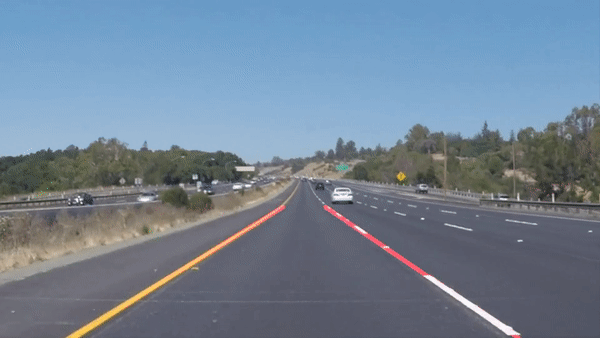

[](https://opensource.org/licenses/MIT)  

# **CarND-LaneLines-P1** 
The repository completes the project on [Udacity Self-Driving Car NanoDegree.](http://www.udacity.com/drive)
The project algorithm is used to identify lane lines on the road in videos using Python and OpenCV.
## Demo

<table>
<tr>
<td></td>
<td></td>
</tr>
</table>
 
## Setup
1. install [Miniconda](https://docs.conda.io/en/latest/miniconda.html)
2. Create an environment named `carlines` for the project.
```sh
conda env create -f carlines.yml
```
3. Activate the environment with the command: 
- Linux:
```sh
source activate carlines
```
- Windows:
```sh
conda activate carlines
```
4. Open the [Pipeline1.ipynb](Pipeline1.ipynb) in the Jupyter Notebook.
```sh
jupyter-notebook
```

## Overview
### 1. Pipeline
The pipeline consists of following image processing functions:

- `grayscale`: Convert the input image to grayscale using `cv2.cvtColor` method.
- `guassian_blur`: Apply a Gaussian blur to get smoother derivatives of grayscale image using `cv2.GaussianBlur` method.
- `canny`: Apply [Canny Edge Detection](https://docs.opencv.org/4.x/da/d22/tutorial_py_canny.html) to find edges on the blured image using `cv2.Canny` method.
- `regin_of_interest`: Apply an image mask to limit the detection area.
- `hough_lines`: Use a [Hough transform](https://docs.opencv.org/3.4/d3/de6/tutorial_js_houghlines.html) to find Hough lines on the masked image using `cv2.HoughLinesP` method.
- `draw_lines`: Distinguish the left and right lane lines by the slope of the straight line, while excluding infinite slope values. 
Use `np.polyfit` to calculate slope and offset of averaged lane lines respectively. Thus, start and end points of lane lines can be obtained using the fitted function. 
Use `cv2.line` method to connect left and right lane lines.
- `weighted_img`: Use `cv2.addWeighted` method to return a image with lines drawn on it.

### 2. Shortcomings
The results obtained by processing the challenge video did not meet expectations. Shadows on the road surface and different colored lines in the video affect the accuracy of the algorithm. Therefore, the algorithm is not robust enough.

### 3. Possible improvements
Apply color transforms, perspective transform or other methods.
